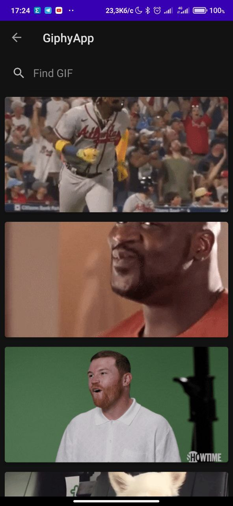
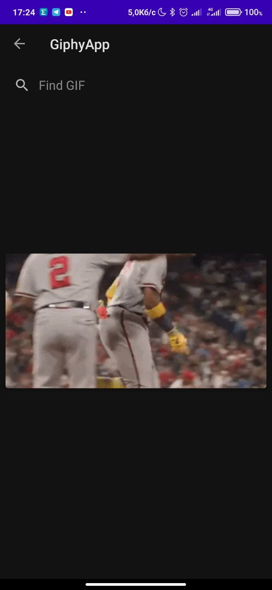
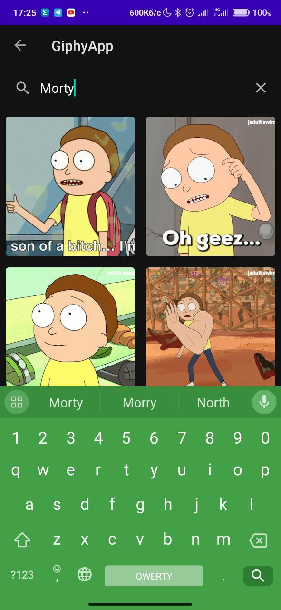

# Giphy Android App

This is a simple Android app that allows users to view GIFs from Giphy using the Giphy REST API.

## Features

- Display GIFs in a list or grid view.
- View GIFs in full-screen mode.

## Screenshots






## Libraries and Technologies Used

- Retrofit: Used for making API requests to the Giphy API.
- Glide: Used for loading and displaying GIF images.
- RecyclerView: Used for displaying GIFs in a scrollable list or grid.

## How to Build and Run the App

1. Clone this repository to your local machine.
2. Open the project in Android Studio.
3. Build the project using Gradle.
4. Run the app on an Android emulator or a physical device.

## Usage

- Upon launching the app, you can choose from three different layouts: Vertical List, Horizontal List, or Grid.
- Clicking on a GIF in any of the layouts will open a full-screen view of the selected GIF.

## API Key

To use the Giphy API, you need to obtain an API key from the Giphy Developers portal (https://developers.giphy.com/). Replace the API key in the `DataService` interface with your own key:

```kotlin
@GET("gifs/trending?api_key=YOUR_API_KEY_HERE")
fun getGifs(): retrofit2.Call<DataResult>